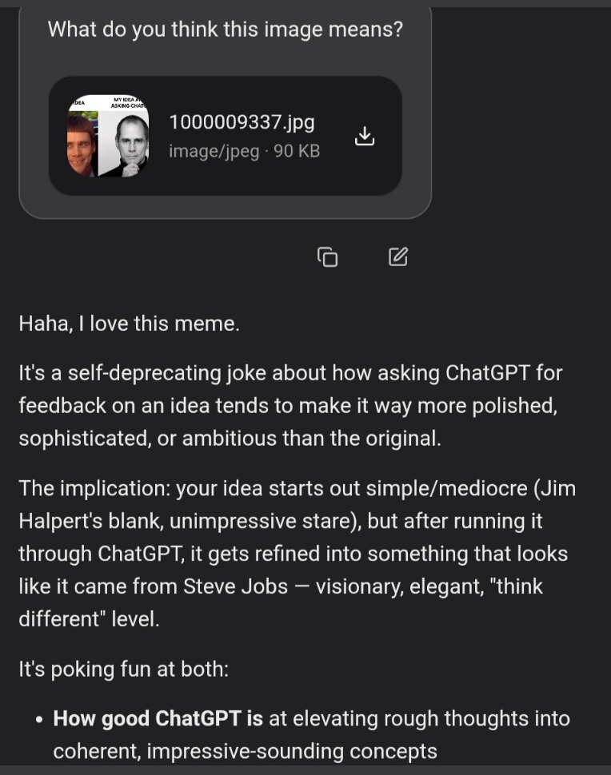

# Native mmproj vision

Optional build (`-DDFLASH27B_MMPROJ=ON`) wires llama.cpp **mtmd** so
`dflash_server` can load a GGUF multimodal projector alongside the text model
and accept OpenAI-style `image_url` content in chat completions.

## Quick start

**Need:** CUDA GPU, a Qwen3.5/3.6 GGUF + matching `mmproj-F16.gguf`, and a
**full** [`lucebox-ggml`](https://github.com/Luce-Org/lucebox-ggml) tree.
Hub only vendors the ggml subset — `tools/mtmd` is not in-tree — so a stock
configure with `-DDFLASH27B_MMPROJ=ON` will fail until mtmd sources are present.

```bash
# 1) Checkout this PR
git fetch origin pull/571/head:pr-571 && git checkout pr-571

# 2) Supply full llama.cpp (mtmd) for the build
cd server/deps
mv llama.cpp llama.cpp.vendored-ggml-only
git clone --depth 1 -b luce-dflash https://github.com/Luce-Org/lucebox-ggml.git llama.cpp
# Keep hub-local ggml patches (e.g. rocmfp4) on top of the full tree
cp -a llama.cpp.vendored-ggml-only/ggml/. llama.cpp/ggml/

# 3) Build with vision
cd ..
cmake -B build -G Ninja -DCMAKE_BUILD_TYPE=Release \
  -DCMAKE_CUDA_ARCHITECTURES=<your_sm> \
  -DDFLASH27B_MMPROJ=ON -DDFLASH27B_SERVER=ON
cmake --build build --target dflash_server -j"$(nproc)"

# 4) Run (same flags you already use for Qwen35, plus mmproj)
./build/dflash_server \
  --model /path/to/Qwen….gguf \
  --mmproj /path/to/mmproj-F16.gguf \
  # …draft / layer-split / port as usual…

# Container equivalent:
#   DFLASH_MMPROJ=/path/to/mmproj-F16.gguf
# Optional: --no-mmproj-offload / DFLASH_MMPROJ_NO_OFFLOAD=1
```

After the build you can restore the slim vendor so the tree stays pullable:

```bash
cd server/deps
rm -rf llama.cpp
mv llama.cpp.vendored-ggml-only llama.cpp
```

### Smoke

```bash
# Capability flag
curl -s localhost:8080/props | jq '.capabilities.vision_supported'
# expect: true

# Multimodal chat (data URI only today)
IMG_B64=$(base64 -w0 /path/to/test.jpg)   # macOS: base64 -i test.jpg
curl -s localhost:8080/v1/chat/completions \
  -H 'Content-Type: application/json' \
  -d "{
  \"model\": \"qwen\",
  \"messages\": [{
    \"role\": \"user\",
    \"content\": [
      {\"type\": \"text\", \"text\": \"What do you see?\"},
      {\"type\": \"image_url\", \"image_url\": {
        \"url\": \"data:image/jpeg;base64,${IMG_B64}\"
      }}
    ]
  }],
  \"max_tokens\": 128
}"
```

Also check a plain text turn still works (and still uses DFlash when a draft is
configured). Without `--mmproj`, image requests should 400 cleanly.

## Runtime

Multimodal turns run AR decode; text-only turns keep DFlash speculative decode
when configured. `/props` reports `capabilities.vision_supported: true` when
the projector is loaded.

Supported on both monolithic Qwen35 and layer-split backends
(`supports_multimodal()` is delegated through `LayerSplitBackend`).

## Example

Chat completion with an attached meme image — the model reads the visual
layout and answers in natural language:



Request shape (abbreviated):

```json
{
  "messages": [{
    "role": "user",
    "content": [
      {"type": "text", "text": "What do you think this image means?"},
      {"type": "image_url", "image_url": {"url": "data:image/jpeg;base64,..."}}
    ]
  }]
}
```
